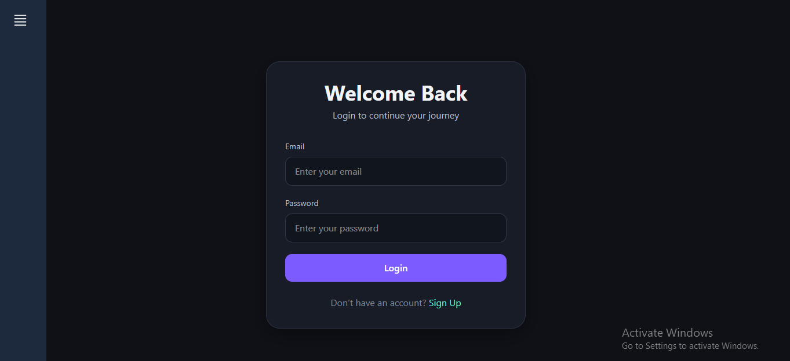
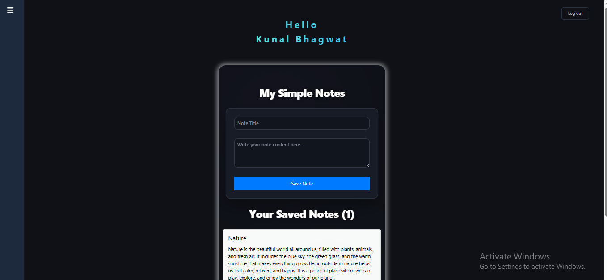
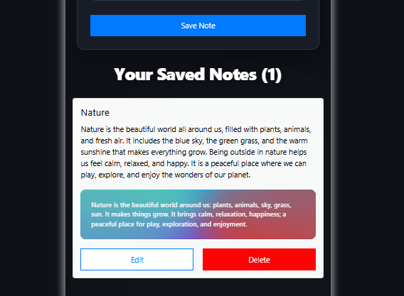

# NoteVault

A modern note-taking web application built with React, Firebase, and Gemini AI.

NoteVault allows users to securely create, manage, and organize notes while leveraging AI-powered summarization to quickly extract key information from note content.

This project was built as a personal learning and portfolio project to gain hands-on experience with Firebase services, AI integration, and modern frontend development.

---

## Features

### Authentication

- User Signup
- User Login
- Secure Authentication using Firebase Authentication

### Notes Management

- Create Notes
- Edit Notes
- Delete Notes

### AI Integration

- Generate note summaries using Gemini AI
- Quickly extract key information from long notes

### User Experience

- Responsive Design
- Modern UI built with Tailwind CSS
- Clean and intuitive user interface

---

## Tech Stack

### Frontend

- React
- JavaScript
- Tailwind CSS
- React Router

### Backend & Database

- Firebase Authentication
- Firestore Database

### AI

- Gemini AI

---

## Project Objectives

This project was created to explore:

- Firebase Authentication
- Firestore CRUD Operations
- Gemini AI Integration
- React Application Architecture
- State Management
- Responsive UI Development
- Modern Frontend Best Practices

---

## Screenshots

### Login Page



### Notes Dashboard



### AI Summary Generation



---

## Installation

Clone the repository:

```bash
git clone https://github.com/kb2016/notevault-ai.git
```

Navigate to the project directory:

```bash
cd notevault
```

Install dependencies:

```bash
npm install
```

Create a `.env` file in the root directory:

```env
VITE_GEMINI_API_KEY=your_free_ai_studio_key_here

VITE_FIREBASE_API_KEY=your_firebase_key
VITE_FIREBASE_AUTH_DOMAIN=your_auth_domain
VITE_FIREBASE_PROJECT_ID=your_project_id
VITE_FIREBASE_STORAGE_BUCKET=your_storage_bucket
VITE_FIREBASE_MESSAGING_SENDER_ID=your_sender_id
VITE_FIREBASE_APP_ID=your_app_id
```

Start the development server:

```bash
npm run dev
```

Build the project:

```bash
npm run build
```

---

## Firebase Security

This application uses Firebase Authentication and Firestore security rules to ensure users can only access their own data.

---

## Disclaimer

This project was developed independently for personal learning, experimentation, and portfolio demonstration purposes.

It is not affiliated with, endorsed by, or associated with any employer, client, or third-party organization.

No proprietary, confidential, or client-related code has been used in this project.

---

## Future Improvements

- AI-powered note enhancement
- Smart tagging
- Dark/Light theme toggle
- Export notes
- Advanced search and filtering
- Rich text editor

---

## Author

Kunal Bhagwat

Frontend Developer

GitHub: https://github.com/kb2016

---

If you found this project interesting, feel free to explore the code and share your feedback.
